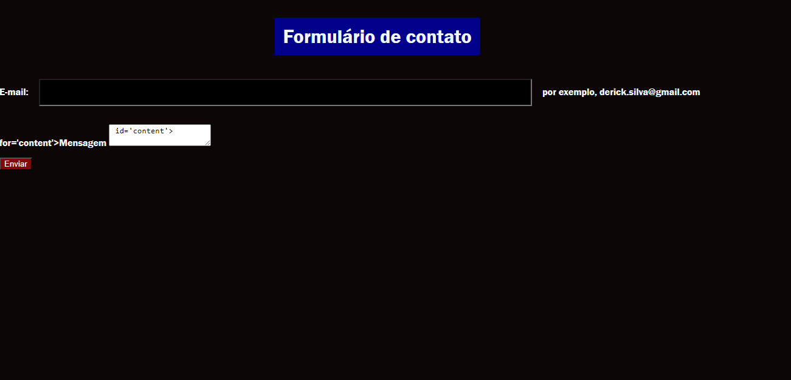

# form-contato

## descrição do projeto 
É um projeto  no Github que apresenta um projeto pratico de um formulario de contato.
Desenvolvido com HTML5 e CSS3, a função desse projeto é fornecer um exemplo de um formulario interativo e estilizado.

## tecnologias ultilizadas
* HTML5
* CSS3
* Git Hub
* Git 
* Vscode

## Elementos e atributos utilizados
* Button: é um elemento interativo ativado por um usuário com mouse, teclado, dedo, comando de voz ou outra tecnologia assistiva. Uma vez ativado, ele executa uma ação, como enviar um formulário ou abrir uma caixa de diálogo.
* Body: O elemento HTML &lt;body&gt; representa o conteúdo de um documento HTML. Pode haver apenas um elemento em um documento.
* Img: O elemento HTML &lt;img&gt; incorpora uma imagem no documento.
* Input: O elemento HTML &lt;input&gt; é usado para criar controles interativos para formulários baseados na Web, a fim de aceitar dados do usuário; Uma grande variedade de tipos de dados de entrada e widgets de controle estão disponíveis, dependendo do dispositivo e do agente do usuário. O elemento é um dos mais poderosos e complexos em todo o HTML devido ao grande número de combinações de tipos de entrada e atributos.
 * Label: O elemento HTML &lt;label&gt; representa uma legenda para um item em uma interface do usuário.